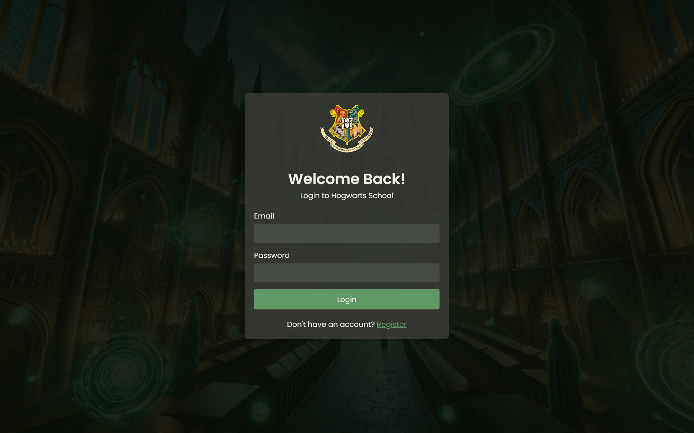
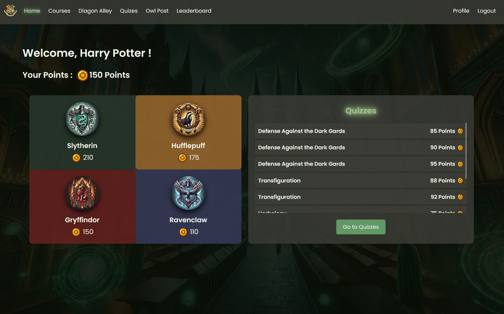
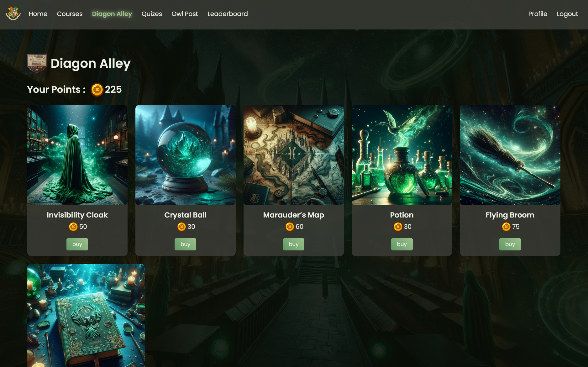
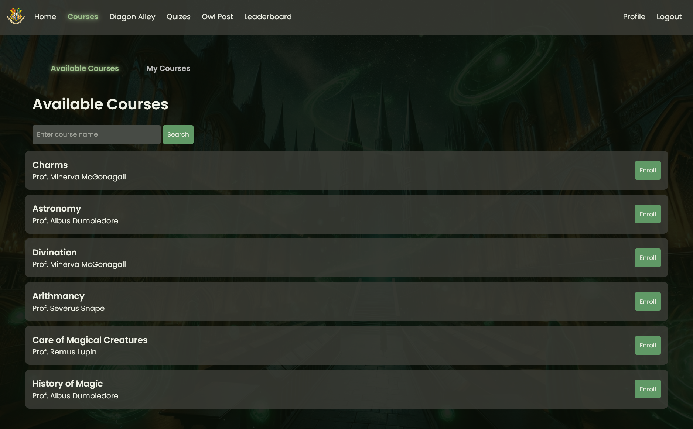
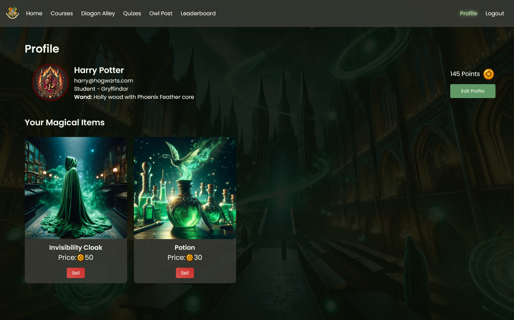

# Hogwarts for Programming 🪄🔮

A web-based platform inspired by the magical world of Hogwarts, designed to teach programming through interactive courses, quizzes, and challenges. Users can enroll in courses, solve quizzes, and track their progress on leaderboards.

This project was completed in collaboration with [Rahf](https://github.com/Rahf-Ayman) and [Badr](https://github.com/TrueBadr) as part of the IEEE ZSB Backend track.

## Contribution

Follow these steps to set up the project on your local machine:

### Prerequisites

1. Install [PHP](https://www.php.net/downloads) (version 7.4 or higher).
2. Install [Composer](https://getcomposer.org/download/), the dependency manager for PHP.
3. Install [MySQL](https://dev.mysql.com/downloads/) or any compatible database.

### Setup Instructions

1. Clone the repository:
   ```bash
   git clone https://github.com/r6mez/Hogwarts-For-Programming.git
   cd Hogwarts-For-Programming
   ```

2. Install dependencies using Composer:
   ```bash
   composer install
   ```

3. Set up the database: run queries in `schema/schema.sql` and to populate database run `schema/query.sql`, and to view database settings head to `config/config.php`.

4. Start the development server:
   ```bash
   php -S localhost:8000 -t public
   ```

5. Open your browser and navigate to `http://localhost:8000`.

## Project Structure

- `public/`: Contains public-facing files, including the entry point `index.php` and static assets.
- `src/`: Core application logic, including controllers, validators, and utility classes.
- `config/`: Configuration files, such as database credentials and route definitions.
- `Schema/`: SQL scripts for setting up the database schema.
- `vendor/`: Composer dependencies (generated after running `composer install`).
- `.gitignore`: Specifies files and directories to exclude from version control.
- `README.md`: Documentation for setting up and understanding the project.

## Demo Images

Below are some demo images of the project:

- **Login Page**  
  

- **Home Page**  
  

- **Diagon Alley Page**  
  

- **Course Enroll Page**  
  

- **Quizzes Page**  
  

- **Solve Quiz Page**  
  

- **Leaderboard Page**  
  

- **Profile Page**  
  


- **Dashboard**  
  